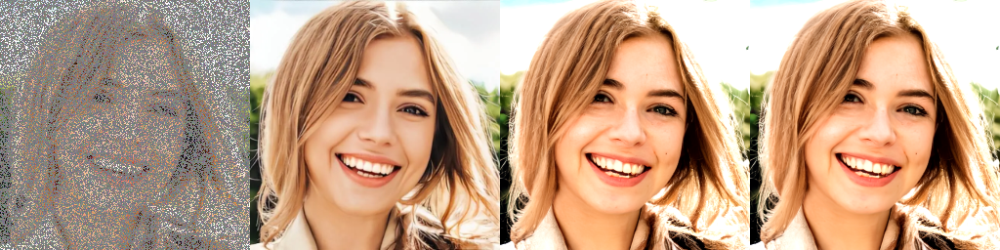

# Plug-and-play Split Gibbs Sampler (PnP-SGS)


A PyTorch implementation of the "Plug-and-play split Gibbs sampler: integrating deep generative priors into Bayesian inference" paper, focused on solving inverse imaging problems using DDPM-based regularization.

## Overview

This repository implements the PnP-SGS algorithm, which combines:
- Split Gibbs Sampling
- Denoising Diffusion Probabilistic Models (DDPM)
- Variable splitting optimization techniques

The implementation currently supports image inpainting, with the potential to extend to other inverse problems like deblurring and super-resolution.

## Features

- Full posterior distribution sampling for inverse imaging problems
- Integration with pre-trained DDPM models
- Sparse matrix operations for efficient computation
- Support for RGB image inpainting
- Adaptive noise estimation and denoising steps
- Configurable sampling parameters


## Parameter Tuning

The algorithm is sensitive to parameter selection. Here are recommended ranges:

- `rho`: Coupling parameter [0.1, 0.5] (0.33 recommended)
- `sigma`: Noise level [0.05, 0.2] (0.1 recommended)
- `n_steps`: Total MCMC steps [100, 200]
- `burn_in`: Burn-in period [30, 50]

## Results

Expected reconstruction quality for image inpainting (75% masked pixels):
- PSNR: ~25-30 dB
- SSIM: ~0.8-0.9
- Computation time: ~7 minutes (NVIDIA RTX 3080)

## Known Limitations

1. Computational overhead compared to simpler methods like DPS
2. Sensitive to parameter `rho`
3. Background reconstruction may be less accurate than foreground
4. Memory intensive for large images

## Citation

If you use this implementation in your research, please cite:

```bibtex
@article{coeurdoux2023plug,
  title={Plug-and-play split Gibbs sampler: integrating deep generative priors into Bayesian inference},
  author={Coeurdoux, Florentin and Dobigeon, Nicolas and Chainais, Pierre},
  year={2023}
}
```
